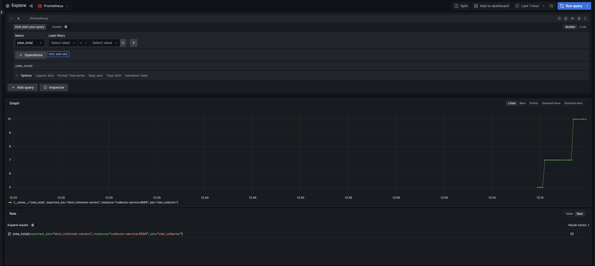

# kbot-observability

--------

## Розгортання
Встановити секрет base64 для вашого бота в kbot.yaml маніфест секрет

Для тесту знадобиться k8s кластре.

Для розгортання виконать команду
```make init```

Доступ до графани
Прокинути порт
```kubectl port-forward svc/grafana-service 8080:3002```

Відкритив Браузері 
```localhost:8080```

Метрики kbot
